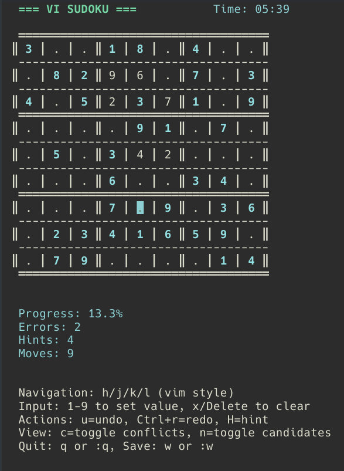

# vi-sudoku

Sudoku CLI game with user interactions based on Vim



## how to

1. `git clone` this repo and `cd` into the folder

2. install [uv](https://docs.astral.sh/uv/getting-started/installation/)

3. run it

```sh
uv run main.py
```